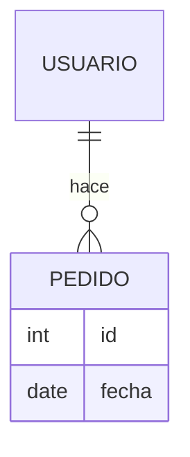

# BACKEND · <nombre de la idea>

<!-- Primero el esquema, después los endpoints. La usuaria valida el diagrama de entidades. -->

## Entidades y relaciones
<!-- Un nodo por entidad; las relaciones con su cardinalidad. Reemplazá el ejemplo. -->

## Campos por entidad
<!-- Una tabla por entidad. Tipo, si es obligatorio y una nota si hace falta. -->
### <Entidad>
| Campo | Tipo | Obligatorio | Nota |
|---|---|---|---|
| id | | sí | |

## Endpoints
<!-- Método, ruta, qué hace y quién puede llamarlo. OpenAPI completo solo si hace falta. -->
| Método | Ruta | Qué hace | Quién puede |
|---|---|---|---|
| | | | |

## Datos sensibles
<!-- Qué datos son sensibles y dónde viven. Nunca pongas secretos ni claves en este documento. -->
| Dato | Dónde vive | Quién accede |
|---|---|---|
| | | |

## Migraciones
<!-- Solo como archivos versionados, en orden. No se cambia la base a mano. -->
-
