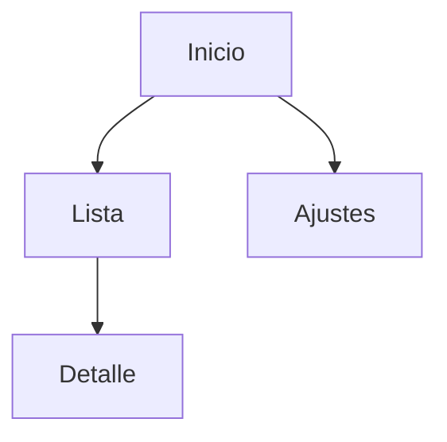
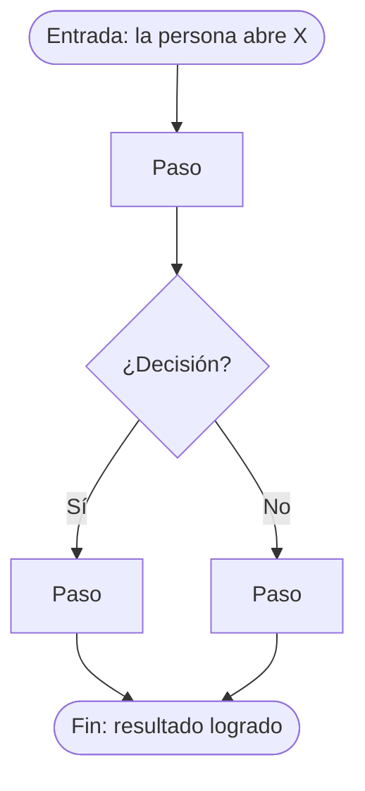

# FLUJO · <nombre de la idea>

<!-- Flujo de pantallas en Mermaid, editable por agentes. Lo usa la usuaria para confirmar el recorrido antes de diseñar. -->

## Sitemap
<!-- Todas las pantallas y cómo se llega de una a otra. Reemplazá los nodos de ejemplo. -->

## User flows
<!-- Un diagrama por tarea principal. Cada uno con: entrada (de dónde viene), decisiones (rombos) y fin (qué logra la persona). Copiá el bloque para cada tarea. -->

### Tarea 1 · <nombre>

## Pantallas
<!-- Una fila por pantalla del sitemap. Propósito en una frase: qué hace la persona ahí. -->
| Pantalla | Propósito |
|---|---|
| | |
